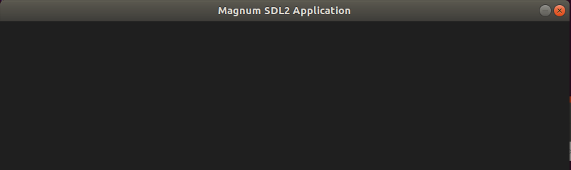
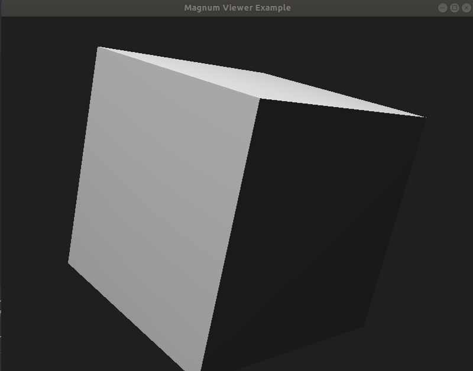
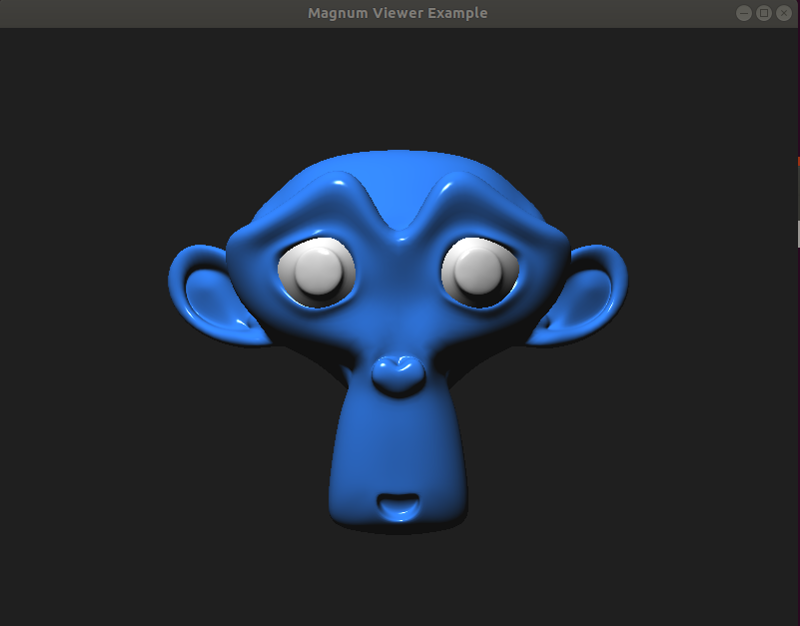
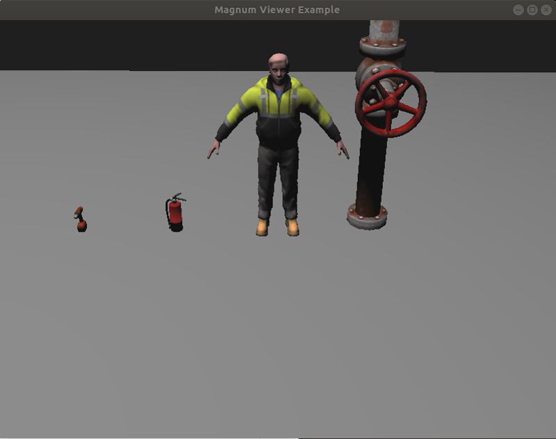
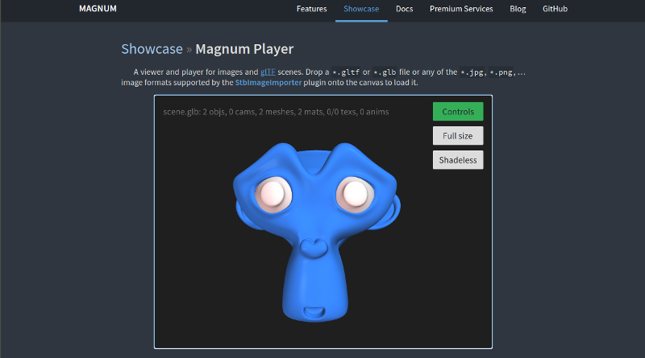

A place to play with the Magnum rendering engine.

https://magnum.graphics/

## Magnum installation

Install the Corrade dependency (part of the Magnum project):

```
mkdir -p ~/workspace && cd ~/workspace
git clone https://github.com/mosra/corrade.git
cd corrade
mkdir build && cd build
cmake -DCMAKE_INSTALL_PREFIX=/usr ..
make -j
sudo make -j install
```

Clone the Magnum repository:

```
mkdir -p ~/workspace && cd ~/workspace
git clone https://github.com/mosra/magnum.git
cd magnum
git checkout v2020.06
```

Compile Magnum:

```
mkdir build && cd build
cmake -DCMAKE_INSTALL_PREFIX=/usr -DWITH_SDL2APPLICATION=ON ..
make -j
sudo make -j install
```

For testing, download the `magnum-bootstrap` project:

```
mkdir -p ~/workspace && cd ~/workspace
git clone https://github.com/mosra/magnum-bootstrap.git
cd magnum-bootstrap
git checkout base
```

Compile `magnum-bootstrap`:

```
mkdir build && cd build
cmake ..
make -j
```

And run our first application:

```
./src/MyApplication
```



Other branches of `magnum-bootstrap` contain examples with other toolkits such
as GLFW or Qt.

References:
  * [Building Corrade](https://doc.magnum.graphics/corrade/building-corrade.html#building-corrade-manual)
  * [Building Magnum](https://doc.magnum.graphics/magnum/building.html#building-manual)
  * [Building and running `magnum-bootstrap`](https://doc.magnum.graphics/magnum/getting-started.html)


## An `obj` loader example

Magnum is very modular and comes with optional features that can be enabled on
demand.

Next, we're going to execute an example that loads an `.obj` file. We'll need to
enable the basic `obj` importer included in Magnum:

```
cd ~/workspace/magnum/build
cmake -DCMAKE_INSTALL_PREFIX=/usr -DWITH_SDL2APPLICATION=ON -DWITH_ANYIMAGEIMPORTER=ON -DWITH_ANYSCENEIMPORTER=ON -DWITH_OBJIMPORTER=ON ..
make -j
sudo make -j install
```

Now, let's clone `magnum-examples`, compile, run the `viewer` example:

```
mkdir -p ~/workspace && cd ~/workspace
git clone https://github.com/mosra/magnum-examples.git
cd magnum-examples/src/viewer/
mkdir build && cd build
cmake ..
make -j
./magnum-viewer ~/workspace/magnum-examples/src/viewer/scene.obj
```

You should be able to visualize a cube that can be rotated with the mouse:



References:
  * [Viewer example](https://doc.magnum.graphics/magnum/examples-viewer.html)


## An `glb` loader example

Extra Magnum features can be installed via plugins. In this example, we'll load
a `glb` scene via the `TinyGltfImporter` contained in `magnum-plugins`.

Let's clone `magnum-plugins`:

```
mkdir -p ~/workspace && cd ~/workspace
git clone https://github.com/mosra/magnum-plugins.git
cd magnum-plugins
git checkout v2020.06
```

By default, no plugins are compiled, let's enabled the `TinyGltfImporter`:

```
mkdir build && cd build
cmake -DCMAKE_INSTALL_PREFIX=/usr -DWITH_STBIMAGEIMPORTER=ON -DWITH_TINYGLTFIMPORTER=ON ..
make -j
sudo make -j install
```

Let's go back to our `viewer` example and load a scene with a custom texture:

```
cd ~/workspace/magnum-examples/src/viewer/build
./magnum-viewer ~/workspace/magnum-examples/src/viewer/scene.glb
```

You should be able to visualize our well-known monkey that can be rotated with
the mouse:



Here's another example with other assets used in Gazebo. Download Magnum.glb
from here: https://www.dropbox.com/sh/xxlv8zfl09p7nbn/AAAvsuPoMcDobAf4dKKTNWdYa?dl=0&preview=Magnum.glb

Then launch the `viewer`:

```
./magnum-viewer ~/Downloads/Magnum.glb
```



The `Magnum Player` is a very nice example for loading scenes in the browser:

https://doc.magnum.graphics/magnum/magnum-player.html

Click on the `Live web version` button, and then, drag and drop into the scene
the same `glb` file used before:



References:
  * [Viewer example](https://doc.magnum.graphics/magnum/examples-viewer.html)
  * [Magnum Player](https://doc.magnum.graphics/magnum/magnum-player.html)
  * [Magnum architecture diagram](https://magnum.graphics/features/extras/)
